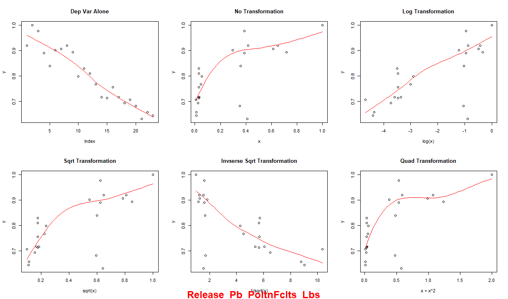

[RETURN HOME](https://cjknoble.github.io/)

# Coding Portfolio

### High-Level Covariation Mining

- **Description:** This code was utilized to generate relationships within a system dynamics model. The script performs data analysis by fitting multivariate linear regression and grey models with various transformations. It includes functions for generating grey model parameters, plotting scatter plots with different transformations, calculating and recording R-squared values from linear models, and generating and storing regression outputs, all while handling data preprocessing and visualization.
- **Language:** R
- **Key Packages:** stats, GreyModel
- **Link:** [R Script File](https://github.com/cjknoble/NewarkDataMining/blob/main/Covariation%20Mining%20Script.R)

 

### Mining Google Search and Google Trends Data 

- **Description:** This code performs web scraping to collect Google search result counts and Google Trends data for specified keywords over a selected timeframe. Using the RSelenium package, it navigates to Google search pages for each keyword and extracts the total number of search results for each month. Additionally, it fetches historical Google Trends data for the same keywords using the gtrendsR package, compiling the data into dataframes that are then exported as CSV files for further analysis.
- **Language:** R
- **Key Packages:** RSelenium, gtrendsR
- **Link:** [R Script File](https://github.com/cjknoble/NewarkDataMining/blob/b593d531eca4a7b223fb0beb05ea135c2a6b568a/R%20-%20Google%20Trends%20and%20Search%20Engine%20Scraping.R)

 

### Collecting, Cleaning, and Analyzing Tweets 

- **Description:** This code retrieves and processes geolocated tweets in New Jersey using the Twitter API. It first sets up API tokens and constructs a query to fetch relevant tweets, which are then saved as JSON files. The script subsequently imports these JSON files, cleans and processes the tweet text by removing unnecessary characters and stopwords, and performs text analysis to tokenize and count word occurrences. Finally, it filters and summarizes the word counts, exporting the cleaned and analyzed data to a CSV file.
- **Language:** R
- **Key Packages:** rtweet, academictwitteR, dplyr, jsonlite
- **Link:** [R Script File](https://github.com/cjknoble/Paper-EJ_Twitter/blob/57a06b5d5f8a5e6bea7a6c2217dda594bed5d5d2/PullingTweets.R)

 

### Scraping EJ Publication Abstracts for Most Popular Words

- **Description:** This code scrapes and processes PDFs of environmental justice research publications to analyze abstract word frequencies. It reads PDF files in the current directory, converts their text into a corpus, and cleans the text. The code identifies and extracts terms that appear frequently across the documents, calculates their total occurrences, and writes the sorted word counts to a CSV file for further analysis.
- **Language:** R
- **Key Packages:** pdftools, tm, rvest
- **Link:** [R Script File](https://github.com/cjknoble/Paper-EJ_Twitter/blob/ba02134a158b4255911e5b66b14ddae47a31cf1f/ScrapingAbstracts.R)

  

### Running Statistical Analyses On Environmental Justice "Awareness"

- **Description:** This code conducts an analysis of environmental justice awareness based on tweet counts within census tracts. It imports shapefiles containing tweet data and calculates a normalized environmental justice awareness metric. The code then explores the linear relationships between this awareness metric and various demographic and environmental variables through scatter plots and linear models. Additionally, it checks for spatial autocorrelation and fits spatial error models to account for potential spatial dependencies in the data.
- **Language:** R
- **Key Packages:** sf, spdep
- **Link:** [R Script File](https://github.com/cjknoble/Paper-EJ_Twitter/blob/31a2ca8e00d2b19ac8cf521900d3387b24b24dbe/StatAnalysis_SAR.R)

  

### Automating Spatial Joins in GIS using ArcPy

- **Description:** This Python script uses the ArcPy library to process point data by importing tables, adding spatial attributes, and performing spatial joins to assign zone information. It then exports the processed data and converts them to text files for further analysis.
- **Language:** Python
- **Key Packages:** arcpy, dbf
- **Link:** [Python Script as Text File](./assets/codefiles/Python - Spatial Join Automation with ArcPy.txt)
