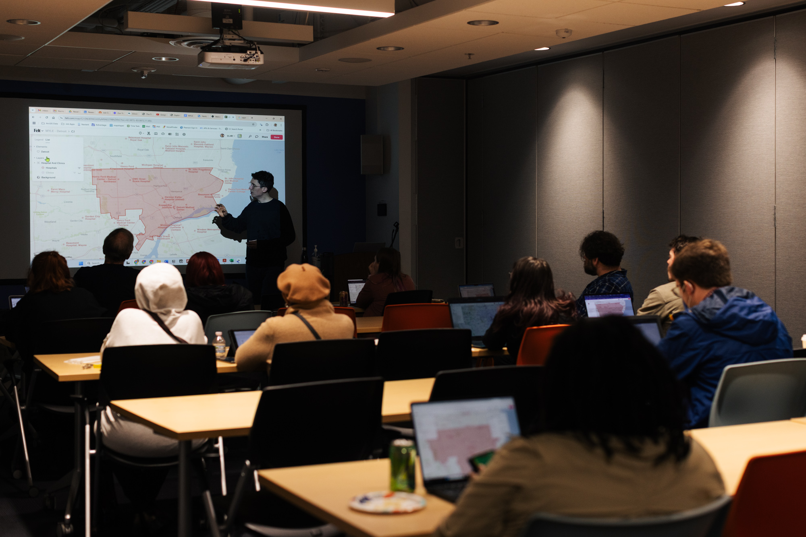
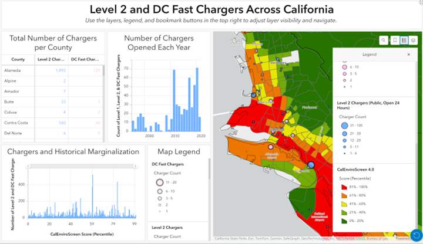
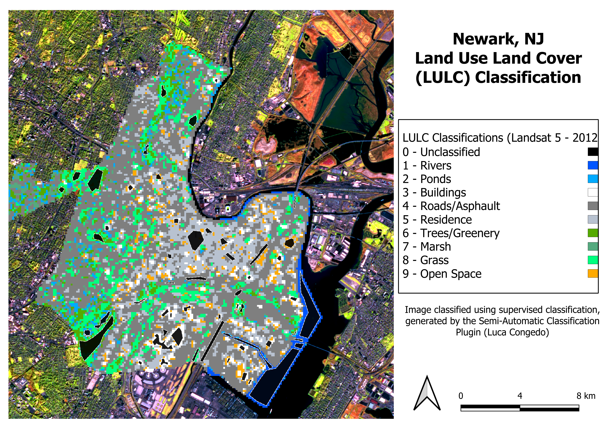
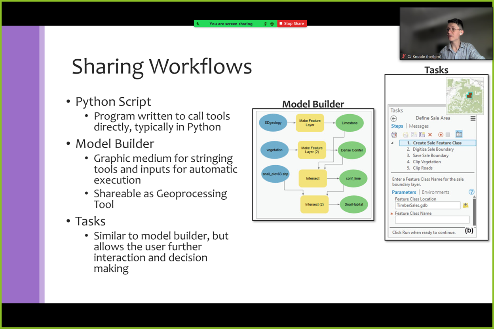
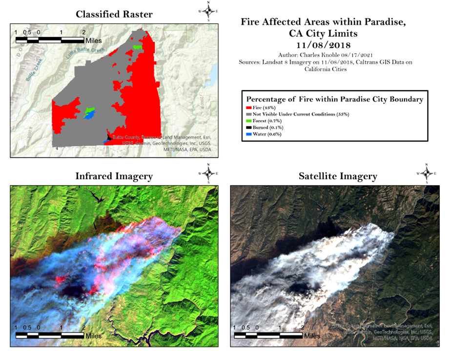
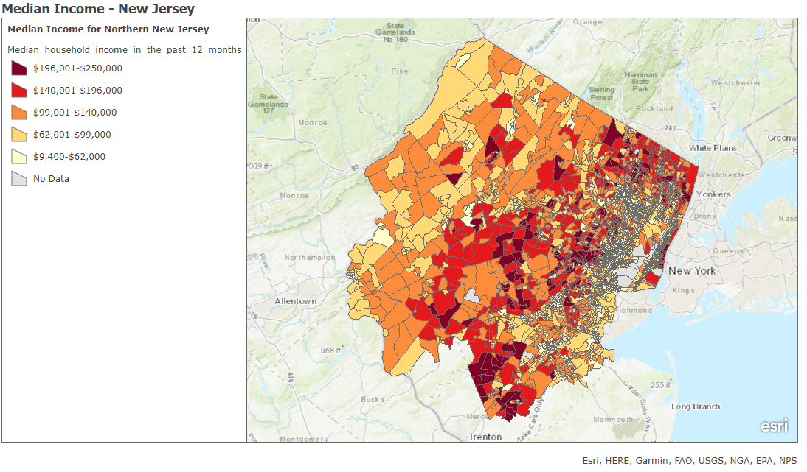
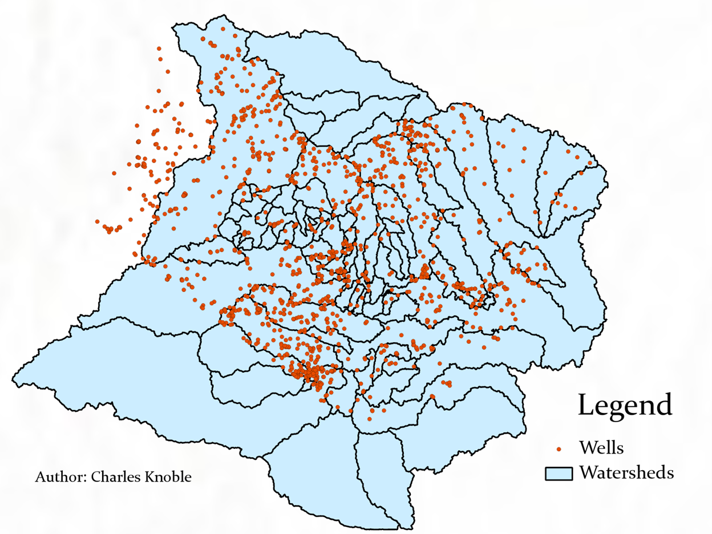
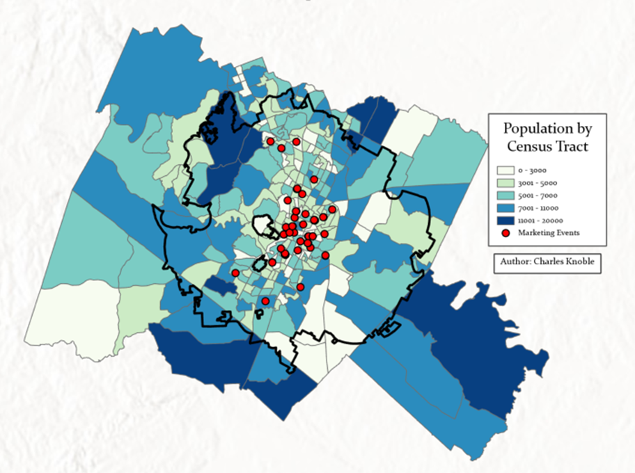
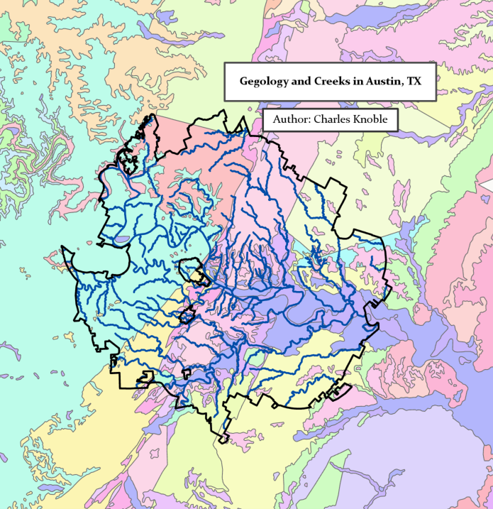

[RETURN HOME](https://cjknoble.github.io/) | [TESTIMONIALS](./testimonials.html)

# GIS Portfolio 

## _Total Paid Hours_
**Consultant for _Starcrest Consulting LLC_**: 400+ Hours  
**Independent Contractor**: 400+ Hours  
**University Lecturer and Lab Instructor**: 220 Hours

## _Projects_

### Journalistic Mapping for Environmental Justice Workshops 
- **Description:** This workshop series, titled Mapping Your Local Environment (MYLE), aimed to empower Detroit and Atlanta journalists to integrate map making and geospatial data into their environmental reporting. Each workshop was 2 hours, including a lecture on geography and data justice principles, and a lab introducing local data acquisition and visualization approaches through Felt.   
- **Skills and Deliverables:** Felt, GIS and Geospatial Data Basics, Interactive Data Visualization 

### Interactive Dashboard of EV Chargers Across California
- **Description:** This dashboard is an example of data acquisition, cleaning, and specialization resulting in an interactive dashboard. CSV data containing information on EV chargers in California were cleaned, plotted, and overlayed with state datasets.
- **Skills and Deliverables:** ArcGIS Online, Interactive Data Visualization, Spatial Analysis
- **Link:** [Dashboard](https://montclair.maps.arcgis.com/apps/dashboards/d4113e3aeaea44529c3d5a37b35877f1)

### Machine Learning Image Classification - QGIS and Landsat Imagery 
- **Description:** In this project, remote sensing imagery drawn from Landsat was used to estimate the distribution of water, greenery, and urban structures in a Land Use Land Cover Classification. Training samples were generated for each category of land cover and fed into a machine learning algorithm, converting the raster image into a vector feature class. The QGIS plugin Semi-Automatic Classification was used for this project. 
- **Skills and Deliverables:** QGIS, Machine Learning Tools, Semi-Automatic Classification Plugin

### GIS Training for Data Analysis Team
- **Description:** A nonprofit organization sought to introduce GIS to their 20-person data analysis team, most of whom had limited GIS experience. Over two separate 1-hour sessions, I provided a general introduction to GIS and a tutorial on conducting spatial analyses using PowerPoint, PollEverywhere, and ArcGIS Pro, tailored to the organization's specific workflows and goals. By the end, the team was proficient in cleaning datasets, conducting Joins, and utilizing geoprocessing tools for cartographic overlays.
- **Skills and Deliverables:** ArcGIS Pro, Training, Spatial Analysis

### Active Wildfire Investigation
- **Description:** In this educational assignment, I estimated the distribution of a wildfire in Paradise, CA. I acquired Landsat 8 satellite imagery and applied a false-color composite to identify, classify, and quantify the extent of the active fire.  
- **Skills and Deliverables:** ArcGIS Pro, Supervised Classification

### Habitat Suitability Analysis
- **Description:** I was tasked with identifying the areas in the Sturgis, South Dakota area that fit the habitat criteria outlined by the client. I was provided with an elevation raster, vegetation shapefile, geology shapefile, and roads shapefile. The areas of interest were those that were between 1200 and 1600 meters in elevation, had high levels of limestone, were within 200 meters of a road, and had high vegetation density. An overlay was conducted to rank areas by the extent to which they met the desired criteria.
- **Skills and Deliverables:** Site Assessment, Geospatial Analysis, Overlay

### Interactive Map - Visualizing Income in Northern New Jersey
- **Description:** The goal of this project was to create an interactive map showing the relative household income across Northern New Jersey. I was responsible for locating the Census data, pre-processing the CSV, and joining the results with TIGER/Line shapefiles. Income data were drawn from the American Community Survey's 2019 estimate at the Census Block Group level. This resolution provided a detailed, interactive map that could be explored by the public through ArcGIS Online and ArcGIS programs.
- **Skills and Deliverables:** ArcGIS Online, Data Cleaning, Cartography
- **Link:** [Online Map](https://services9.arcgis.com/QHXEWAb0pE2rvfbb/arcgis/rest/services/Median_Income_Map__Online_/FeatureServer)

### Additional Examples - Basic Visualizations
- **Description:** Above are a number of additional visualizations created in ArcGIS Pro. Final products can be shared as static or dynamic maps, curated to match the preferred style guidelines.
- **Skills and Deliverables:** Data Visualization, GIS, Cartography
