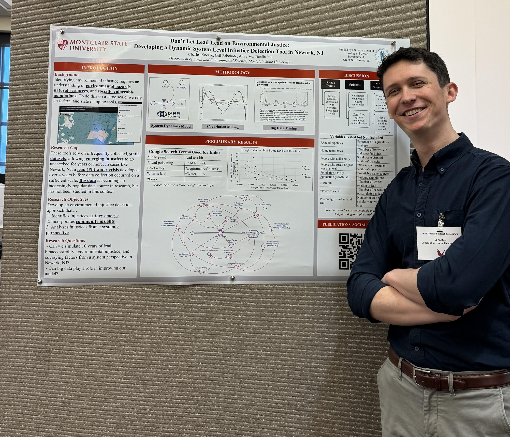

[RETURN HOME](https://cjknoble.github.io/)

# Presentations

### Interview: The Promise of Big Data - Climate, Justice, and Governance in Big Data
- **Link:** [Video Snippet](https://www.instagram.com/reel/DGVm4xqqBjI/?utm_source=ig_web_copy_link&igsh=MzRlODBiNWFlZA==) and [Full Article](https://theclimateasterisk.substack.com/p/the-promise-of-big-data-climate-justice?r=4k5ovi&utm_campaign=post&utm_medium=web&triedRedirect=true)
- **Date:** February 2025
- **Event:** Interview with Nu Data
- **Host:** Nhi Corcoran
- **Details:** 
  - Invited to speak on the potential opportunities and risks presented by big data in the climate justice space 
  - Quoted in article addressing the intersection of data justice and sustainability 

### Panel Moderator & Organizer: Taking GIS Beyond the Classroom 
- **Date:** November 2024
- **Event:** Montclair State University, GIS Day(s) 2024
- **Presenter:** Charles Knoble
- **Details:** 
  - Participated in planning week-long GIS Day(s) celebration including tech demonstration, map gallery, software open house, industry tabling, panel session, and networking dinner
  - Moderated public panel of online and virtual speakers discussing recent GIS trends in research, industry, and hiring
  - Hosted software open house, instructing public attendees on GIS basics using GIS Online, dashboards, and story maps 
 

### Guest Lecturer: GIS in Water Resource Management
- **Date:** November 2024
- **Event:** New Jersey City University, Water Chronicles Course
- **Presenter:** Charles Knoble
- **Details:**
  - Introduced inter-disciplinary group of undergraduate students to GIS in water resources through hybrid lecture
  - Provided hands-on lab exploring lead exposure risk in New Jersey using ArcGIS Online and Story Maps 

### Poster Presentation: Don’t Let Lead Lead on Environmental Justice: Developing a Dynamic System Level Injustice Detection Tool in Newark NJ
 - **Link:** [Poster Abstract](https://digitalcommons.montclair.edu/student-research-symposium/2024/poster03/29/)
- **Date:** May 2024
- **Event:** Clean Energy and Sustainability Analytics Center Annual Summit
- **Presenter:** Charles Knoble
- **Details:**
  - Research poster presentation session hosted by the Clean Energy and Sustainability Analytics Center
  - Presented poster on the development of a simulative tool for detecting lead using environmental, socioeconomic, and big data sources

.JPG)
### Paper Presentation: A System Dynamics Simulative Approach to Lead Remediation in the Era of Big Data
- **Date:** April 2024
- **Event:** American Association of Geographers Annual Meeting 2024
- **Presenter:** Charles Knoble
- **Details:**
  - Paper presentation for the session, GeoAI and Deep Learning Symposium – Responsible GeoAI II: Justice and Accuracy
  - Presentation discussed ongoing research on the development of a system dynamics simulative tool for lead detection with environmental justice considerations 

.png)
### Workshop Host: Practicing Critical GIS in the Era of Big Data and AI
- **Link:** [Video Recording](https://www.youtube.com/watch?v=03EEYN0Qknw)  
- **Date:** March 2024
- **Event:** University of California Davis, maptimeDavis Group
- **Presenter:** Charles Knoble
- **Details:**
  - Developed and led two-hour hybrid workshop for 20 in-person and online attendees 
  - Engaged attendees with Critical GIS publications and Big Data environmental research
  - Conducted hands-on demonstration using ArcGIS Online to analyze and assess big data

### Speaker: GIS Professionals Presentations
- **Date:** November 2023
- **Event:** Montclair State University, Geographic Information Systems Day
- **Presenters:** Charles Knoble, Nicholas D’Ambrosio, Amy Ferdinand, Rolihlahla Ferdinand
- **Details:**
  - Public presentations from a group of public, private, and academic GIS professionals on the application of GIS in different fields
  - Provided 30-minute presentation on the basics of GIS and the importance of integrating Critical GIS 

### Paper Presentation: Trends in Modern Environmental Justice Studies: A Review of the Techniques, Methodologies, and Findings
- **Date:** May 2023
- **Event:** Sigma Xi Student Research Symposium, Montclair State University
- **Presenter:** Charles Knoble
- **Details:**
- Environmental science symposium hosted by Montclair State University's Sigma Xi chapter 
- Informational presentation discussing recent trends in environmental justice research publications

### Poster Presentation: Environmental Justice in New Jersey: An Exploration of Twitter as an Early Detection Tool
- **Link:** [Poster Abstract](https://digitalcommons.montclair.edu/student-research-symposium/2023/poster02/20/)
- **Date:** April 2023
- **Event:** Montclair State University, Student Research Symposium
- **Presenter:** Charles Knoble 
- **Details:**
  - Research poster presentation session hosted by Montclair State University 
  - Presented poster on results derived from big data integration investigation for environmental justice

.jpg)
### Paper Presentation: A Big Data Exploration of Injustice: Twitter Data and Environmental Justice in New Jersey
- **Date:** March 2023
- **Event:** American Association of Geographers, Annual Meeting 2023
- **Presenter:** Charles Knoble
- **Details:**
  - Paper presentation for Symposium on Harnessing the Geospatial Data Revolution for Sustainability Solutions: Data-intensive and Computational Geography
  - Presentation discussed research on the integration of social media and remote sensing big data into environmental injustice detection
 

### Speaker: Guide to Fleet Electrification
- **Date:** October 2020
- **Event:** Center for Sustainable Energy
- **Presenters:** Tim Mensalvas, Rick Teebay, Charles Knoble, Bridget Tighe
- **Details:**
  - Instructional webinar addressing fleet electrification mandates and policies
  - Presented on pressing California mandates and addressed potential upcoming policy shifts
