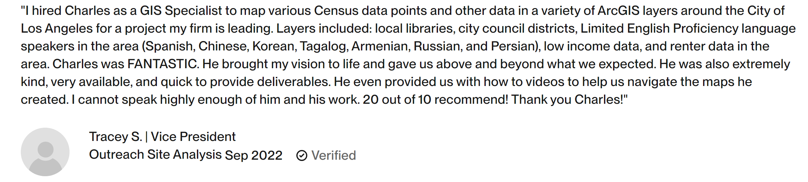
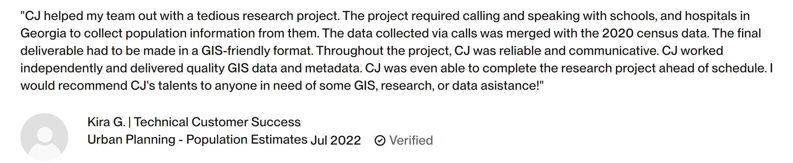
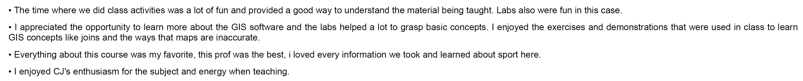

[RETURN HOME](https://cjknoble.github.io/)

# Testimonials
### _Endorsements from past clients and students_
 

### "Skilled and Efficient ArcGIS Consultant - Language Needs Analysis"

- **Summary of Original Project Request:** Seeking an experienced ArcGIS consultant to analyze and map the top languages spoken by low-income, limited English proficiency households in Los Angeles, CA. The analysis should specify languages beyond broad categories, such as distinguishing between Chinese and Korean. The project requires mapping both collectively and individually by language, identifying areas with significant language needs, and providing a written report highlighting the top census tracts and zip codes. This project is time-sensitive due to previous delays.
- **Project Deliverables:** Around a dozen static and interactive maps detailing the distribution of spoken language in Los Angeles in relation to public libraries. Maps were made available in ArcGIS Online, as individual PDFs, and as large-scale poster boards.   
- **Link:** [Source of Testimonial](https://www.upwork.com/freelancers/~01f893e1f53f02598b)

### "GIS Specialist for Visualization, Analysis and Design"

- **Summary of Original Project Request:** We are seeking a GIS Analyst to support consulting projects focusing on data joins, analysis, map design, and data visualization using GIS software. You will collaborate with a multidisciplinary team to deliver complex technical projects, leveraging your geospatial skills. We value passion for digital technology and a desire to expand skills and challenge conventions. Applicants should have a B.S. or M.S./M.A. in Geography, GIS, or a related field with 2-5 years of experience and proficiency with Esri software (ArcPro, ArcMap, ArcGIS Online, Web App Builder).
- **Project Deliverables:** Feature classes of aggregated and geographically weighted disaggregated population datasets, verified through direct outreach nad packaged into a geodatabase.
- **Link:** [Source of Testimonial](https://www.upwork.com/freelancers/~01f893e1f53f02598b)

### "Help with Geo-Spatial Data"

- **Summary of Original Project Request:** I have a JSON file with detailed information on POS (Point of Sales), including geospatial data. I need an analysis of the defined perimeter around three urban areas to identify what is within these perimeters based on the available data. This includes calculating average distances between POS and categorizing them by type. The final output should evaluate the quality of the facilities within these perimeters. Additionally, suggestions for visualizing the results and delivering maps or graphs would be appreciated.
- **Project Deliverables:** A site selection report identifying where to release sustainability products based on quality of fit ranking. Visuals provided also included static and interactive choropleth maps of suggested locations.
- **Link:** [Source of Testimonial](https://www.upwork.com/freelancers/~01f893e1f53f02598b)

### "What was your favorite part of this course and/or what did you find most valuable?"

- **Summary of Original Project Request:** Selected results from an anonymous survey provided to students who completed the undergraduate Introduction to GIS and Remote Sensing course. The above answers are responding to the question "What was your favorite part of this course and/or what did you find most valuable?". 
- **Link:** [Full Report](./assets/EAES210SP24Survey.pdf)
